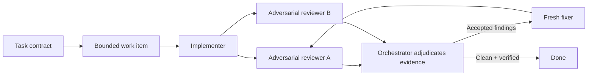

<div align="center">

# Bun Loop

**Implement. Review adversarially. Fix. Repeat until the evidence says done.**

[](https://github.com/Lzeutschler/bun-loop-skill/actions/workflows/validate.yml)
[](LICENSE)
[](skills/bun-loop-skill/SKILL.md)

</div>

---

## What is Bun Loop?

Bun Loop is a portable agent skill for complex, high-risk software work. It turns
one coding agent into an orchestrator that delegates implementation, sends the
result to two independent adversarial reviewers, assigns accepted findings to a
fresh fixer, and repeats until explicit quality gates pass.

The workflow is inspired by Jarred Sumner's
[Bun rewrite in Rust](https://bun.com/blog/bun-in-rust): separate the author from
the reviewers, assume plausible code is wrong, and improve the process whenever a
defect pattern repeats.

## How it works



The skill enforces five ideas:

- **Split contexts:** implementers do not review their own work; reviewers do not
  inherit the implementer's reasoning.
- **Two adversarial reviews:** each reviewer tries to demonstrate how the patch
  breaks, regresses, or violates the task contract.
- **One writer at a time:** parallelism is used for read-only review, not competing
  edits in a shared worktree.
- **Evidence-based completion:** compilation is evidence, not completion. Tests,
  acceptance criteria, review findings, and integration checks determine done.
- **Fix the process:** repeated defect classes update the active contract and review
  rubric instead of being patched one by one forever.

## Quick start

Install directly from GitHub with Node.js 18 or newer:

```bash
npx github:Lzeutschler/bun-loop-skill --claude --global
```

Replace `--claude` with your runtime and choose either `--global` or `--local`:

```bash
npx github:Lzeutschler/bun-loop-skill --codex --global
npx github:Lzeutschler/bun-loop-skill --cursor --local
npx github:Lzeutschler/bun-loop-skill --runtime claude,codex,cursor --global
```

Restart the runtime after installation so it rescans its skills directory.

## Supported runtimes

The installer follows the flat, native skill layouts documented in
[GSD Core's runtime mapping matrix](https://github.com/open-gsd/gsd-core/blob/next/docs/reference/skill-mapping-matrix.md).
Unlike GSD's multi-artifact command and agent sources, Bun Loop is already a
standards-shaped skill with minimal `name` and `description` frontmatter, so the
same canonical `SKILL.md` can be copied without provider-specific prompt forks.

| Runtime | Flag | Global skills root | Project skills root |
|---|---|---|---|
| Claude Code | `--claude` | `~/.claude/skills/` | `.claude/skills/` |
| Codex | `--codex` | `~/.codex/skills/` | `.codex/skills/` |
| Cursor | `--cursor` | `~/.cursor/skills/` | `.cursor/skills/` |
| GitHub Copilot | `--copilot` | `~/.copilot/skills/` | `.github/skills/` |
| OpenCode | `--opencode` | `~/.config/opencode/skills/` | `.opencode/skills/` |
| Kilo | `--kilo` | `~/.config/kilo/skills/` | `.kilo/skills/` |
| Kimi | `--kimi` | `~/.config/agents/skills/` | `.agents/skills/` |
| Cline | `--cline` | `~/.cline/skills/` | Not supported by Cline |

Runtime configuration environment variables are respected: `CLAUDE_CONFIG_DIR`,
`CODEX_HOME`, `CURSOR_CONFIG_DIR`, `COPILOT_CONFIG_DIR`, `OPENCODE_CONFIG_DIR`,
`KILO_CONFIG_DIR`, `KIMI_CONFIG_DIR`, `CLINE_CONFIG_DIR`, and `XDG_CONFIG_HOME`.

Installation support does not manufacture subagent capabilities. The runtime must
provide independent agent contexts for the full loop; otherwise the skill reports a
capability blocker instead of pretending that one context is independent.

## Other installation methods

### Interactive installer

Clone the repository and run the installer without flags:

```bash
git clone https://github.com/Lzeutschler/bun-loop-skill.git
cd bun-loop-skill
node bin/install.js
```

### Custom skills directory

```bash
node bin/install.js --target ~/.agents/skills
```

`--target` means “skills root”; the installer creates
`<target>/bun-loop-skill/` beneath it.

### Manual install without Node.js

Download or clone the repository, then copy the complete
`skills/bun-loop-skill/` directory beneath one of the skills roots in the table
above. Preserve the directory name and keep `SKILL.md` directly inside it:

```text
<runtime skills root>/
└── bun-loop-skill/
    ├── SKILL.md
    └── agents/
        └── openai.yaml
```

Restart the runtime after copying. The `agents/openai.yaml` file provides Codex UI
metadata and is harmless in runtimes that ignore it.

### Claude plugin marketplace

The repository includes `.claude-plugin/plugin.json` and
`.claude-plugin/marketplace.json`. Claude-compatible runtimes can add
`Lzeutschler/bun-loop-skill` as a custom marketplace source and install
`bun-loop-skill` through their native plugin UI.

## Installer commands

```text
--global          Install for the current user
--local           Install into the current project
--target <path>   Install into a custom skills directory
--uninstall       Remove only the managed bun-loop-skill directory
--dry-run         Print operations without changing files
--list-runtimes   Print supported runtime identifiers
--version         Print the installer version
--help            Show complete help
```

Examples:

```bash
# Preview without writing
npx github:Lzeutschler/bun-loop-skill --codex --global --dry-run

# Remove a global installation
npx github:Lzeutschler/bun-loop-skill --codex --global --uninstall
```

The installer stages updates beside the destination and swaps them into place. It
never modifies unrelated runtime configuration. Installation refuses to replace
symlinks or non-directories; uninstall also refuses to delete any directory whose
`SKILL.md` does not identify it as `bun-loop-skill`.

## Using the skill

Invoke it explicitly for a complex task:

```text
Use $bun-loop-skill to migrate this subsystem while preserving behavior and
prove the result through independent adversarial reviews.
```

The skill may also trigger implicitly for large migrations, cross-cutting refactors,
compiler or test backlogs, and changes with substantial regression risk. It should
not trigger implicitly for trivial edits or read-only questions.

## Repository layout

```text
skills/bun-loop-skill/   Canonical portable skill
bin/install.js           User-facing installer CLI
lib/installer.js         Runtime layouts and safe file operations
scripts/validate.js      Repository and manifest validation
tests/                   Installer regression tests
.claude-plugin/          Claude plugin and marketplace metadata
.github/                 CI and contribution templates
```

## Development

```bash
npm install
npm run check
npm pack --dry-run
```

`npm run check` validates skill metadata and manifest version parity, then runs the
dependency-free Node test suite. Pull requests run the same checks on Linux, macOS,
and Windows.

See [CONTRIBUTING.md](CONTRIBUTING.md), [SECURITY.md](SECURITY.md), and
[CHANGELOG.md](CHANGELOG.md) for project policies.

## Acknowledgements

- [Jarred Sumner's Bun rewrite](https://bun.com/blog/bun-in-rust) for the
  implement/review/fix loop and adversarial context separation.
- [GSD Core](https://github.com/open-gsd/gsd-core) for the professional,
  multi-runtime packaging model used as architectural inspiration.

## License

[MIT](LICENSE)
